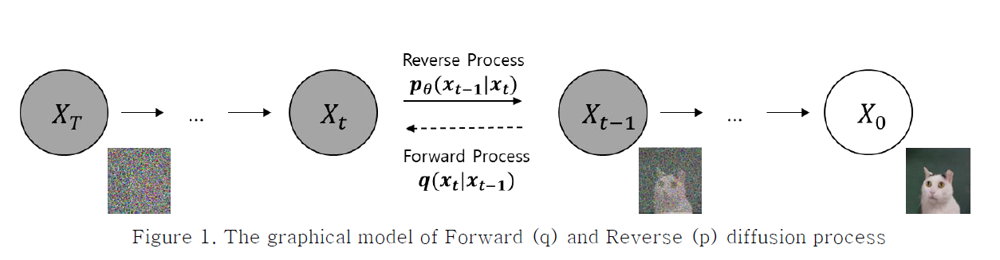
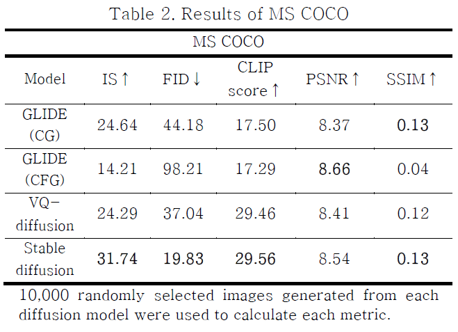

# Diffusion-based_Text-to-Image_Generation

## 📢 Project Overview: 2303~2306

### 주요 기능
- 텍스트 기반 이미지 생성 기능 제공
- Diffusion T2I 모델 성능 비교
- 다양한 평가 지표(e.g., IS, FID ...) 활용
- 통합된 가상 환경에서 간편한 설치 및 실행

### 진행 사항
1. Diffusion 모델 기반 Text-to-Image 생성 모델 실행 코드
2. 🚀 실험 진행 및 논문 작성
    - ✅ (완료) 비교 모델 및 평가 지표 선정
    - ✅ (완료) 비교 모델 4개 - 인퍼런스용 코드 정리
    - ✅ (완료) 평가 지표 5개 - 인퍼런스용 코드 정리
    - ✅ (완료) 실험 진행: MSCOCO 2014 데이터셋 활용
    - ✅ (완료) 논문 작성: 2023 하계 전자공학회 투고 및 게재

----

### 🌟 Diffusion T2I 모델 리스트
- GLIDE (Classifier Guidance)
- GLIDE (Classifier Free Guidance)
- VQ-Diffusion
- Stable Diffusion

### 💫 성능 평가 지표 리스트
- Inception score (IS): 이미지 품질, 다양성
- Fréchet Inception Distance (FID): 이미지 간의 유사성
- CLIP Text Similarity Score (CLIP score): 텍스트와 이미지 간의 의미적 일치도
- Peak Signal-to-Noise Ratio (PSNR): 이미지의 재현 성능
- Structural Similarity Index Measure (SSIM): 이미지 간 구조적 유사성

----

### 💻 실험 방법
#### 1. 가상 환경 설정

```bash
conda create -n diffusion python=3.9
conda activate diffusion

pip install -r requirements.txt
pip install -e .
```
> **Note**: GPU 사용 가능 환경에서 실행 권장

#### 2. 텍스트 데이터 생성

```bash
python ./data/text_preprocessing.py
```

#### 3. 모델 실행

```bash
# 1. GLIDE
python ./model/glide.py --gpus 0

# 2. VQ-Diffusion
python ./model/vq_diffusion.py --gpus 0

# 3. Stable Diffusion
python ./model/stable_diffusion.py --gpus 0
```
> **이미지 저장 경로**: ```./data_gen/{모델명}/image/```


#### 4. 평가 지표 실행 - 성능 비교
```bash
# 1. IS, FID 실행
python ./metric/is_fid.py --model {모델명} --gpus 0

# 2. CLIPScore 실행
python ./metric/clipscore.py --model {모델명} --gpus 0

# 3. PSNR, SSIM 실행
python ./metric/psnr_ssim.py --model {모델명} --gpus 0
```
> **모델명**: glide, vq, stable

> **Glide 모델 추가 옵션**: --classifier

----

### 📄 논문 투고 및 게재 (2023 하계 전자공학회)
A study of text guided image generation based on diffusion model 
[[paper]](./A_study_of_text_guided_image_generation_based_on_diffusion_modelpdf) 

(확산 모델 기반 텍스트 정보를 이용한 이미지 생성 모델 연구)



